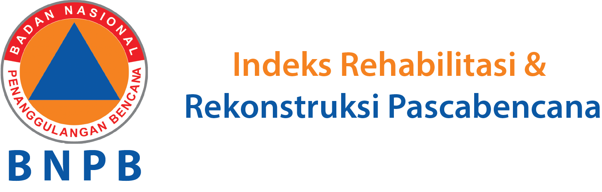

<!-- 

 -->

## Menghitung Indeks Pemulihan Pascabencana Sistem Informasi Rehabilitasi Dan Rekonstruksi Pascabencana

Bencana adalah peristiwa atau rangkaian peristiwa yang mengancam dan mengganggu kehidupan dan penghidupan masyarakat yang disebabkan baik oleh faktor alam dan/ atau faktor non alam maupun faktor manusia sehingga mengakibatkan timbulnya korban jiwa manusia kerusakan lingkungan kerugian harta benda dan dampak psikologis (UU No 24 Tahun 2007):

## Dampak bencana : 
1.	Dampak Sosial Penduduk Aktivitas Penduduk ekonomi sosial keagamaan pelayanan public.
2.	Dampak Non Sosial Infrastruktur Aset Rumah tempat tinggal Lingkungan hidup.

Pengkajian dampak bencana penting dalam rangka merumuskan program strategis penanggulangan bencana baik saat prabencana tanggap darurat dan pascabencana.

- [Simple, fast routing engine](https://laravel.com/docs/routing).
- [Powerful dependency injection container](https://laravel.com/docs/container).
- Multiple back-ends for [session](https://laravel.com/docs/session) and [cache](https://laravel.com/docs/cache) storage.
- Expressive, intuitive [database ORM](https://laravel.com/docs/eloquent).
- Database agnostic [schema migrations](https://laravel.com/docs/migrations).
- [Robust background job processing](https://laravel.com/docs/queues).
- [Real-time event broadcasting](https://laravel.com/docs/broadcasting).

Laravel is accessible, powerful, and provides tools required for large, robust applications.

## Ina-PDRI Mikro

indeks pemulihan pascabencana dimana wilayah terdampak bencana hanya sebagian kecil dr wilayah suatu kabupaten kota mengukur di tingkat desa kelurahan).

## Pengukuran indeks didasarkan pada:

1.	Analisis data di tingkat desa kelurahan
    a.	Data primer (survey; didasarkan pada kondisi ter update di desa kelurahan
    b.	Data sekunder (BPBD kab kota , Provinsi , BNPB, dinas , dll
2.	Berbasis sektor & sub sektor yang dikembangkan BNPB.
3.	Membutuhkan sumber daya yang cukup : finansial , personil , dan waktu.

## License

The Laravel framework is open-sourced software licensed under the [MIT license](https://opensource.org/licenses/MIT).
